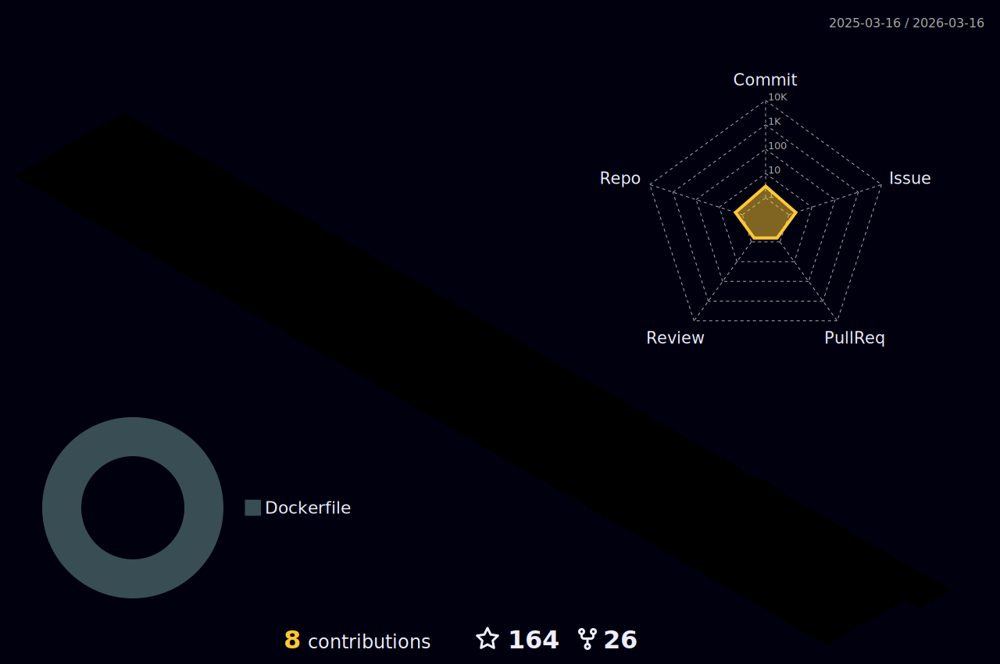

<!-- print hello world -->
<p align="center" style="display: flex;justify-content: center;align-items: center;">
  
</p>

<h1 align="center">Hi 👋, I'm Karenina-na</h1>
<h3 align="center">👤 A developer and student of NWPU 🏨</h3>

<!-- welcome to my profile  -->
<p align="center">
  
  
  
</p>

<!-- quotes -->
<p align="center">
  
  
  
</p>


### 🎍 You are my  visitor, Thank you! 👑👑👑

- 📊 About my Github :

<div align="center" style="display: flex;justify-content: center;align-items: center;">


</div>


<table>
<tr>
<td>

- 📫 How to reach me :


</tr>
</td>
<tr>
<td>

- 🌱 I’m currently learning :


</td>
</tr>
<tr>
<td>

- ⚡ Environment :


</td>
</tr>
</table>


<table>
<tr>
<td>

### 📈 Github Stats

<div align="center" width="190%">
  
</div>

</td>
</tr>
</table>

<div align="center" style="display: flex;justify-content: center;align-items: center;">
<table>
  <tr>
  <td>
    
  </td>
  <td>
    </td>
  </tr>
</table>
</div>

<div align="center" style="display: flex;justify-content: center;align-items: center;">
  <table>
  <tr>
    <td>
      
    </td>
  </tr>

  <tr>
    <td>
      
    </td>
  </tr>

  <tr>
    <td>
      
    </td>
  </tr>
</p>
  </table>
</div>

<p width="100%" align="center">
  
  
</p>


<table>
<tr>
  <td width="50%">
  
  <picture>
    
  </picture>
  </td>
  <td width="50%">
  
  
  </td>
</tr>
</table>


### wakatime stats 📊

<!--START_SECTION:waka-->


**🐱 My GitHub Data** 

> 📦 1.3 MB Used in GitHub's Storage 
 > 
> 🚫 Not Opted to Hire
 > 
> 📜 29 Public Repositories 
 > 
> 🔑 12 Private Repositories 
 > 
**I'm an Early 🐤** 

```text
🌞 Morning                275 commits         █████░░░░░░░░░░░░░░░░░░░░   19.35 % 
🌆 Daytime                470 commits         ████████░░░░░░░░░░░░░░░░░   33.08 % 
🌃 Evening                490 commits         █████████░░░░░░░░░░░░░░░░   34.48 % 
🌙 Night                  186 commits         ███░░░░░░░░░░░░░░░░░░░░░░   13.09 % 
```
📅 **I'm Most Productive on Friday** 

```text
Monday                   160 commits         ███░░░░░░░░░░░░░░░░░░░░░░   11.26 % 
Tuesday                  166 commits         ███░░░░░░░░░░░░░░░░░░░░░░   11.68 % 
Wednesday                221 commits         ████░░░░░░░░░░░░░░░░░░░░░   15.55 % 
Thursday                 198 commits         ███░░░░░░░░░░░░░░░░░░░░░░   13.93 % 
Friday                   235 commits         ████░░░░░░░░░░░░░░░░░░░░░   16.54 % 
Saturday                 212 commits         ████░░░░░░░░░░░░░░░░░░░░░   14.92 % 
Sunday                   229 commits         ████░░░░░░░░░░░░░░░░░░░░░   16.12 % 
```


📊 **This Week I Spent My Time On** 

```text
🕑︎ Time Zone: Asia/Shanghai

💬 Programming Languages: 
Python                   2 hrs 9 mins        █████████████████████████   99.42 % 
GitIgnore file           0 secs              ░░░░░░░░░░░░░░░░░░░░░░░░░   00.58 % 

🔥 Editors: 
PyCharm                  2 hrs 10 mins       █████████████████████████   100.00 % 

🐱‍💻 Projects: 
federal-lr-blockchain    2 hrs 7 mins        ████████████████████████░   97.61 % 
LightEditProject         3 mins              █░░░░░░░░░░░░░░░░░░░░░░░░   02.38 % 
Hand                     0 secs              ░░░░░░░░░░░░░░░░░░░░░░░░░   00.01 % 

💻 Operating System: 
Windows                  2 hrs 10 mins       █████████████████████████   100.00 % 
```

**I Mostly Code in Python** 

```text
Python                   13 repos            ██████░░░░░░░░░░░░░░░░░░░   25.49 % 
Jupyter Notebook         8 repos             ████░░░░░░░░░░░░░░░░░░░░░   15.69 % 
Java                     7 repos             ███░░░░░░░░░░░░░░░░░░░░░░   13.73 % 
TypeScript               4 repos             ██░░░░░░░░░░░░░░░░░░░░░░░   07.84 % 
Rust                     3 repos             █░░░░░░░░░░░░░░░░░░░░░░░░   05.88 % 
```


**Timeline**


 Last Updated on 05/05/2024 18:32:32 UTC
<!--END_SECTION:waka-->


<table>
<tr>
  <td></td>
</tr>
<tr>
  <td></td>
</tr>
</table>
